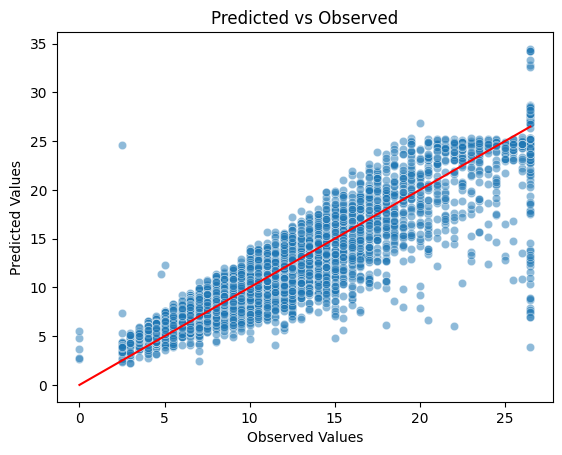

# New York Yellow Taxi 2017 Exploratory Data Analysis and Prediction of Taxi Fare using Machine Learning

## 📊 Project Overview

This project focuses on the 2017 New York Yellow Taxi trip dataset with the aim to both uncover insights about the data and build a machine learning model to predict taxi fares for NYC passengers.

---

## 📁 Dataset Information

- **Source Dataset:** [2017 Yellow Taxi Trip Data](https://data.cityofnewyork.us/Transportation/2017-Yellow-Taxi-Trip-Data/biws-g3hs/about_data)
- **Data Provided By:** Taxi and Limousine Commission (TLC)
- **Data Last Updated:** 14th December 2023
- **Dataset Owner:** NYC OpenData
- **Dataset Description:** These records are generated from the trip record submissions made by yellow taxi Technology Service Providers (TSPs). Each row represents a single trip in a yellow taxi. The trip records include fields capturing pick-up and drop-off dates/times, pick-up and drop-off taxi zone locations, trip distances, itemized fares, rate types, payment types, and driver-reported passenger counts.
- **Dataset Collection:** The data used in the attached datasets were collected and provided to the NYC Taxi and Limousine Commission (TLC) by technology providers authorized under the Taxicab & Livery Passenger Enhancement Programs (TPEP/LPEP). The trip data was not created by the TLC, and TLC makes no representations as to the accuracy of these data.
---

## 🎯 Objective

- Analyze the dataset for:
  - **Data hygiene:** Assess missing values, outliers, duplicates and anomalies.
  - **Variable relationships:** Explore how features like trip distance, duration, time of day, or passenger count relate to fares.
  - **Abnormalities:** Detect atypical or suspicious patterns in the taxi trip data.
- Develop and evaluate a **machine learning model** to estimate Yellow Taxi fares, simulating fares expected by NYC passengers in 2018.

---

## 🤖 Modeling and Evaluation

- For predicting the dependent continuous variable **‘fare_amount’**, a **Multiple Linear Regression** approach was used.
- **Model assessment metrics:**
  - R squared value
  - Root Mean Squared Error (RMSE)
- **Final model performance:**
  - **R squared:** 87.9%
  - **RMSE:** 2.276 (standard deviation in target variable: 6.8285)
- **Statistically significant independent variables** identified by the model:
  - Trip Distance
  - Rate Code
  - Off Hour (Trips between 12 a.m. to 5 p.m.)
  - Vendor ID
  - Rush Hour (Trips between 7 a.m. to 10 a.m. and 5 p.m. to 8 p.m.)

## 📌 Requirements

- Python 3.7+
- Recommended libraries:
  - pandas, numpy, matplotlib, seaborn, plotly
  - scikit-learn, statsmodels
  - jupyter
 
## ℹ️ Acknowledgments

- **Dataset:** Courtesy of [NYC OpenData][1] and Taxi and Limousine Commission (TLC).
- Inspired by open data initiatives for public transportation analytics.

---

*This project does not represent the NYC OpenData or TLC. Data used solely for educational and research purposes.*

[1]: https://data.cityofnewyork.us

